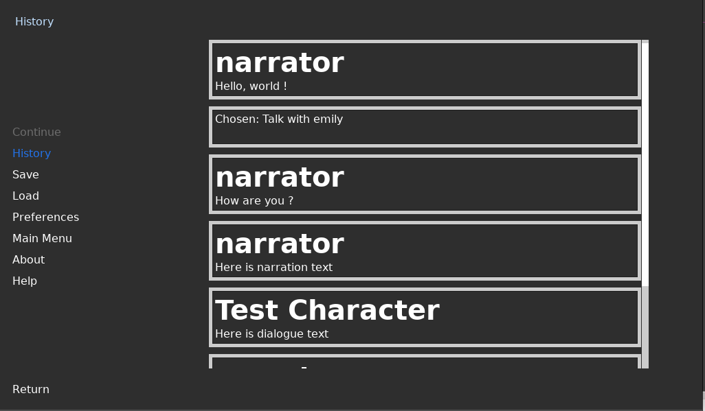
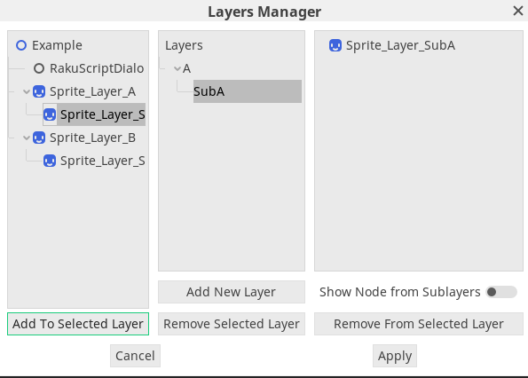

Hi everyone, here is the **11th** devlog of **Rakugo Project**.
This devlog is about new Rakugo Core release and fixes and new features add to VisualNovelKit.
This new features will part of final 1.0 release of VisualNovelKit.

Join our [Patreon](https://www.patreon.com/rakguoteam)

Now we also have Mastodon account that you can follow
https://peoplemaking.games/@rakugo_team


## Rakugo Core 1.1.1

#### Major Updates
* Add signal `execute_script_start(script_name)` to Rakugo [#142](https://github.com/rakugoteam/Rakugo/pull/#142) by @theludovyc
Now when script is launch, Rakugo send a signal *execute_script_start*, with *script_name* in parameter.
* Add `character_exists(char_tag)` and `character_has_variable(var_name)` funcs in [e5918ee70](https://github.com/rakugoteam/Rakugo/commit/e5918ee70bac34382d39d4faacbba43cc2f49217) by @Jeremi360
These funcs return false or true if a Raguko has this character or variable.

### Other Changes
* Rakugo Clean #150 by @theludovyc
Remove not used scripts: AutoTimer, SkipTimer, History as this would be handle by Kits. So, unused nodes in Rakugo.tscn too. And clean dead code.

### Fixed Bugs
* fix TestCharacter by @theludovyc in [#148](https://github.com/rakugoteam/Rakugo/pull/148)

**Full Changelog**: https://github.com/rakugoteam/Rakugo/compare/1.1...1.1.1

## VisualNovelKit
### History



Displays all issues from all conversations held so far in the game.

### Layers Manager



It is a tool that will allow you to assign nodes to specially treated groups.
These groups can then be used to hide Node2D, Spatial or Control from the dialogue level in Rkscript using the keywords `show` and `hide`, by which nvkit extends the scripting language.
It will be similar to what it looks like in Ren'Py :
```renpy
show bg school_front day
show eli school_uniform
# after end of conversation with eli
hide eli
```

That's it from me and theLudovyc, 
we wish you a merry Christmas and a happy new year !
